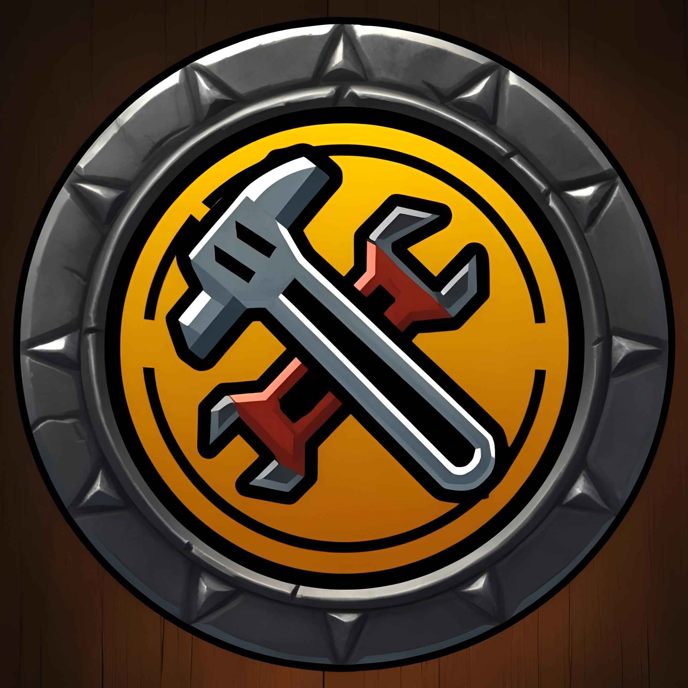

# wow-build-tools

This repository aims to be a collection of tools to help with the development of World of Warcraft addons. The main focus is on speed and ease of use, with the goal of making the development process as smooth as possible.

## Features

I have many plans for this project, and I will communicate those plans at a later date.

### `BigWigsMods/packager` feature parity

To start, I'd like `wow-build-tools` to be as close to a drop-in replacement for `BigWigsMods/packager` as possible. That means, ideally, it should be able to handle all of the same features as `packager` with the same level of ease and speed or better:

- [ ] Support for WoW addons leveraging the following VCS (in order of priority):
  - [x] Git
  - [ ] SVN
  - [ ] Mercurial
- [x] Support storing secrets in a `.env` file
- [ ] Parse a `.pkgmeta` file including support for the following fields:
  - [x] `package-as`
  - [x] `externals` in various forms:
    - [x] Backward-compatible for legacy URLs (e.g. `git.curseforge.com`, `svn.wowace.com`, etc.)
    - [x] "Bare" externals (e.g. `Libs/LibStub: https://repos.wowace.com/wow/ace3/trunk/LibStub`)
    - [x] `url`
    - [x] `tag`
    - [x] `branch`
    - [x] `commit`
    - [x] `type`
    - [x] `curse-slug`
    - [x] `path`
  - [x] `ignore` (test_e2e/test_ignores)
  - [ ] `plain-copy` - needs to be a pattern, and it does not get token replacement
  - [ ] `move-folders`
  - [x] `tools-used`
  - [x] `required-dependencies`
  - [x] `optional-dependencies`
  - [x] `embedded-libraries`
  - [x] `enable-nolib-creation`
  - [ ] `enable-toc-creation`
  - [x] `license-output` (test_e2e/test_license_exist, test_e2e/test_license_download)
  - [x] `manual-changelog`
    - [x] `filename`
    - [x] `markup-type` (`markdown`, `html`, `text`)
  - [x] `changelog-title`
  - [ ] `wowi-create-changelog`
  - [ ] `wowi-convert-changelog`
  - [ ] `wowi-archive-previous`
- [ ] Handle CLI arguments:
  - [x] `-c` Skip copying files to package directory
  - [x] `-d` Skip uploading/distributing
  - [x] `-e` Skip fetching externals
  - [ ] `-l` Skip @localization@ token replacement
  - [ ] `-L` Only do @localization@ token replacement (skip upload to CurseForge)
  - [x] `-o` Keep existing package directory, overwrite contents
  - [x] `-s` Create "nolib" package
  - [ ] `-S` Split toc file for multiple game types
  - [x] `-u` Use Unix line-endings
  - [x] `-z` Skip zip file creation
  - [x] `-t topdir` Specify the top directory of the repository
  - [x] `-r releasedir` Specify the directory to copy files to
  - [x] `-p curse-id` Specify the CurseForge project ID
  - [x] `-w wowi-id` Specify the WoWInterface project ID
  - [x] `-a wago-id` Specify the Wago.io project ID
  - [ ] `-g game-version` Specify the game version for uploading
  - [x] `-m pkgmeta-file` Specify the pkgmeta file to use
  - [x] `-n "{template}"` Tokenized zip file and upload label names
- [ ] Support multiple styles of toc files:
  - [ ] Single TOC and Single Game Type/Flavor
  - [x] Single TOC and Multiple Game Types/Flavors
  - [ ] Multiple TOCs per Game Type/Flavor
  - [ ] Splitting a single TOC into multiple TOCs
- [ ] Download external dependencies (at least happy path)
  - [x] Git Externals (test_e2e/test_git_externals)
  - [x] SVN Externals (test_e2e/test_svn_externals)
  - [ ] Mercurial Externals
- [x] Copy non-ignored files to a "release" directory
- [x] Handle token replacement for the following tokens in `.toc`, `.lua`, and `.xml` files (also undocumented `.md` and `.txt` files also support token replacement):
  - [x] `@package-name@`
  - [x] `@project-version@`
  - [x] `@project-hash@`
  - [x] `@project-abbreviated-hash@`
  - [x] `@project-author@`
  - [x] `@project-date-iso@`
  - [x] `@project-date-integer@`
  - [x] `@project-timestamp@`
  - [x] `@project-revision@`
  - [x] `@file-revision@`
  - [x] `@file-hash@`
  - [x] `@file-abbreviated-hash@`
  - [x] `@file-author@`
  - [x] `@file-date-iso@`
  - [x] `@file-date-integer@`
  - [x] `@file-timestamp@`
  - [x] `@build-date@`
  - [x] `@build-date-iso@`
  - [x] `@build-date-integer@`
  - [x] `@build-timestamp@`
- [ ] Handle `@localization@` token replacement
- [ ] Handle build-type conditional blocks of code through tokens:
  - [x] `@alpha@`
  - [x] `@beta@`
  - [x] `@debug@`
  - [x] `@do-not-package@`
  - [ ] `@no-lib-strip@`
  - [ ] `@retail@`
  - [ ] `@version-retail@`
  - [ ] `@version-classic@`
  - [ ] `@version-bcc@`
  - [ ] `@version-wrath@`
  - [ ] `@version-cata@`
  - [ ] `@version-mop@` - assuming the trend continues
  - [ ] `@version-wod@`
  - [ ] `@version-legion@`
  - [ ] `@version-bfa@`
  - [ ] `@version-sl@`
  - [ ] `@version-df@`
  - [ ] `@version-tww@`
- [ ] Move folders to a different location within the release directory
- [x] Create a zip file of the package directory
- [x] Create a nolib zip file of the package directory
- [ ] Handle tokenized naming for the zip file:
  - [x] `{package-name}`
  - [x] `{project-version}`
  - [x] `{project-hash}`
  - [x] `{project-abbreviated-hash}`
  - [x] `{project-author}`
  - [x] `{project-date-iso}`
  - [x] `{project-date-integer}`
  - [x] `{project-timestamp}`
  - [x] `{project-revision}`
  - [ ] `{game-type}`
  - [ ] `{release-type}`
  - [x] `{alpha}`
  - [x] `{beta}`
  - [x] `{nolib}`
  - [x] `{classic}`
- [ ] Handle tokenized naming for the release label (when uploaded to CurseForge, WoWInterface, etc.)
  - [x] `{package-name}`
  - [x] `{project-version}`
  - [x] `{project-hash}`
  - [x] `{project-abbreviated-hash}`
  - [x] `{project-author}`
  - [x] `{project-date-iso}`
  - [x] `{project-date-integer}`
  - [x] `{project-timestamp}`
  - [x] `{project-revision}`
  - [ ] `{game-type}`
  - [ ] `{release-type}`
  - [x] `{alpha}`
  - [x] `{beta}`
  - [x] `{nolib}`
  - [x] `{classic}`
- [ ] Generate a changelog
  - [x] Git
  - [ ] SVN
  - [ ] Mercurial
- [ ] Creating and Updating GitHub Releases
  - [ ] Upload output assets to GitHub Releases
- [x] Upload to CurseForge
- [ ] Upload to WoWInterface
- [ ] Upload to Wago.io
- [ ] A GitHub Action available via the GitHub Marketplace

Since WoW has been around since 2004, there are a lot of addons that have been around for a long time. The landscape of technology has changed a lot since then, so I will be prioritizing features that I believe are more widely used and more relevant to the current state of the game. If you have a use case that isn't possible yet, please open an issue and I will do my best to address it!

### Additional features

In addition to feature parity with `BigWigsMods/packager`, I have a few ideas for additional features that I think would be useful for addon authors:

- [x] Autoupdating the tool itself
- [ ] More token replacements
- [ ] Guided tour of the tool
- [ ] Various warnings and checks to help catch issues with the addon before packaging
- [ ] Monorepo support
- [ ] Automatic propagation of addon changes to all installed and compatible game versions
- [ ] Option to create a Lua version of the changelog
- [ ] New Addon Scaffolding
- [ ] A badge to proudly display that your addon is built with `wow-build-tools`!

## Inspiration and acknowledgements

My main inspiration comes from my desire to always make developer experience as smooth as possible. I've had a few different roles across different companies and industries that have focused on developer experience, and I've always found it to be a rewarding challenge and a force multiplier for teams. What better way to give back to the WoW community than to align my passions and expertise to help make the development process easier for addon authors?

I was also heavily inspired by [BigWigsMods/packager](https://github.com/BigWigsMods/packager) which provides (to my knowledge) the most widely used tool for packaging addons for distribution via CurseForge, WoWInterface, and Wago.io. Thank you to the authors and contributors of that project for all of their hard work and dedication!
